## Verifying & updating firmware
Stay up to date on firmware releases, follow the Twitter account [@COLDCARDwallet](https://twitter.com/COLDCARDwallet), or bookmark the [Coinkite Blog](https://blog.coinkite.com/). Firmware upgrades provide new features, enhancements, bug fixes, and the latest security updates to your COLDCARD. Firmware upgrade files have a `.dfu` file extension and should be approximately 690 kB in size. The abbreviation should be `20...-coldcard.dfu` to represent the full firmware file name. Make sure to use the full file name in your commands. COLDCARDs will only load and run files signed by a Coinkite approved key.

A great security feature of the COLDCARD is that it can be used completely air-gapped. Meaning that you never have to connect it to a computer, although the option to is there if you choose to use it. You can use a standard USB outlet transformer or even a 9v battery with the COLDPOWER adaptor, which Coinkite offers [here](https://store.coinkite.com/store/cldpwr). To power on the COLDCARD simply connect a USB to micro-USB [cable](https://store.coinkite.com/store/category/accessories) to the port on top of the COLDCARD and the other end to the USB port on your COLDPOWER adaptor & 9v battery and flip the switch on the side of the COLDPOWER adaptor.

  
  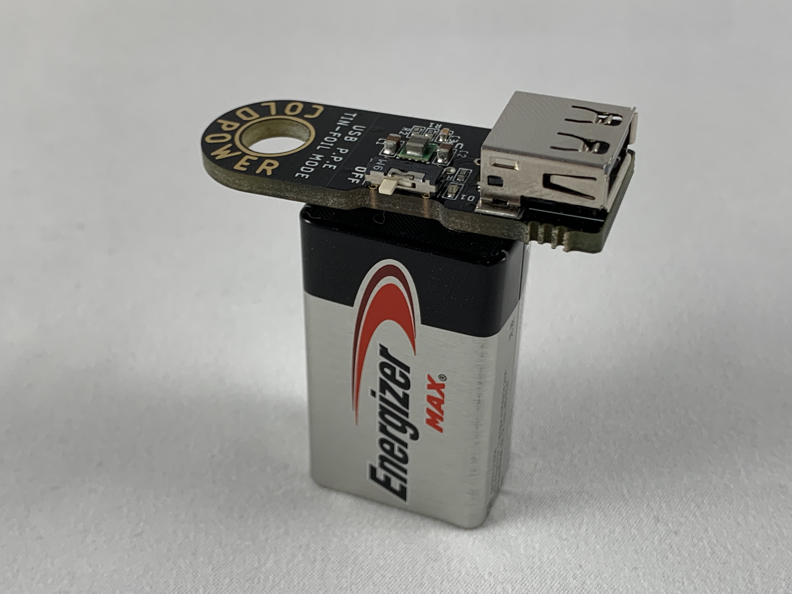

Once powered on, first read and accept the terms of sale & use. Then you will be asked to confirm the bag number. If there are any discrepancies, contact [support@coinkite.com](mailto:support@coinkite.com?subject=%5BContact%5D%20-%20).

  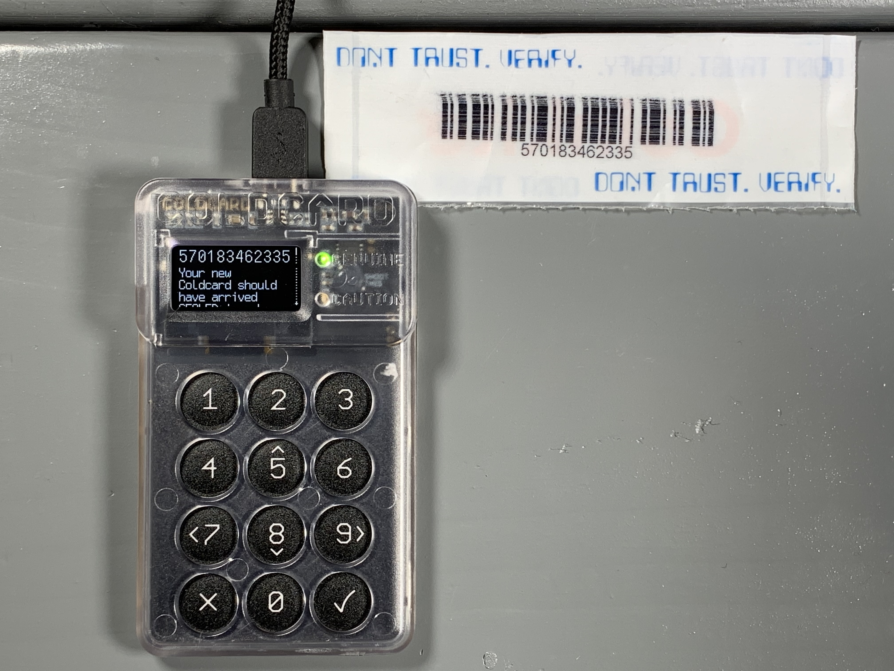

Next, figure out which firmware version the COLDCARD currently has on it by selecting `Advanced` and then scroll down to `Upgrade Firmware` and finally `Show Version`. If your displayed firmware version is older than the most recent version available on the Coinkite website [here](https://coldcard.com/docs/upgrade), then follow the next steps to upgrade. 

  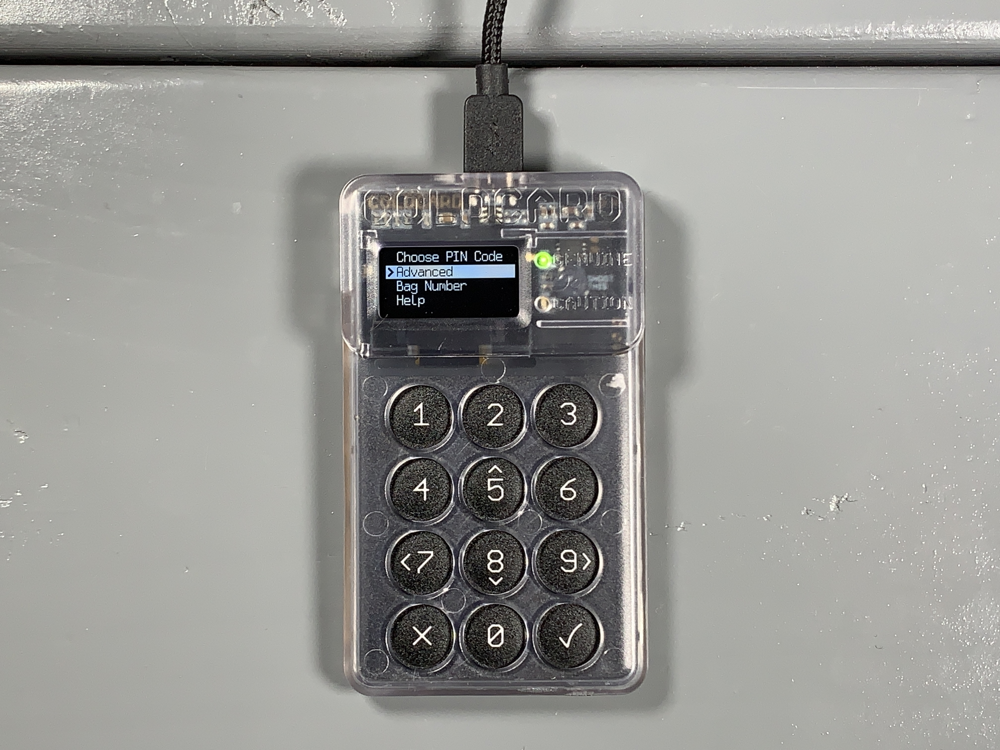
  

  
  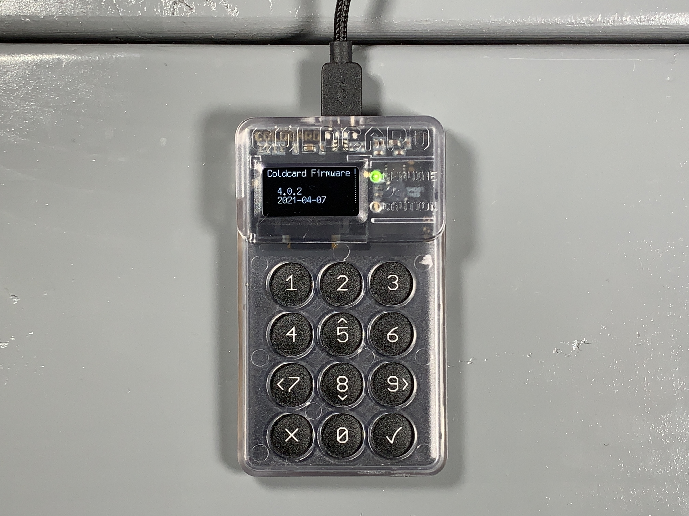

Even the firmware can be upgraded air-gapped by utilizing the microSD card. These steps will show you how to do that and verify the integrity of the firmware file on a Windows desktop using Kleopatra OpenPGP from the [GPG4win](https://www.gpg4win.org/download.html) bundle. If you are using a Linux distribution, you will want to use [GnuPG](https://gnupg.org/download/index.html). Or if you are using a Mac, you will want to use [GPGtools](https://gpgtools.org/). You can also watch [this video tutorial](https://youtu.be/RYcB5HpfcaE). The basic process here is to save the PGP signed hash value of the `.dfu` firmware file and verify it with [Doc Hex's PGP public key](https://twitter.com/dochex) and then calculate your own hash value on the firmware file to confirm. 

From the Coinkite [website](https://coldcard.com/docs/upgrade), click on the link for the latest firmware version at the top of the page. This will automatically download a .dfu file. 

  

  
From that same web page, scroll down towards the bottom to the advanced section and then click on the `this clear-signed text file` link. That link will open a PGP signed message containing the SHA256 hash values of various firmware versions.

  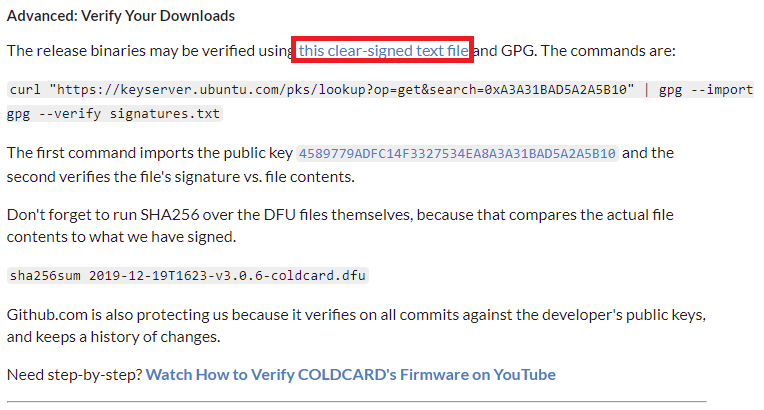
  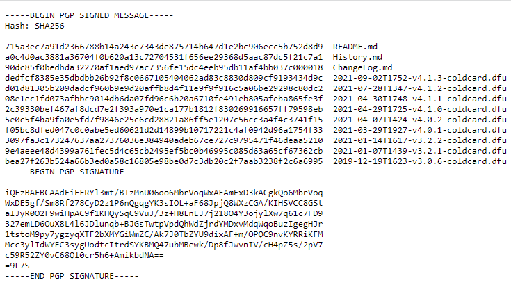

You want to save this PGP signed message as an `.asc` file, you can just hit `ctrl+s` from your web browser and you should be presented with a pop-up window like the one below. Make sure you have the `All Files (*.*)` option selected from the `Save as type:` drop-down menu. And then save the file with the `.asc` extension. You can leave it named `signatures`. 

  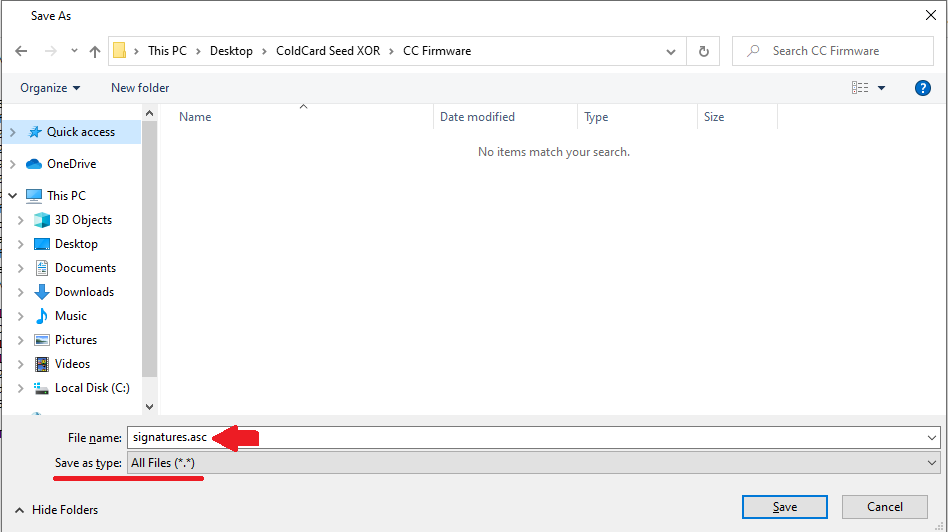

  
Next, you need to get Doc Hex's public PGP key and import it to your Kleopatra keychain so you can certify it. Doc Hex's public key can be copied from this keyserver [here](https://keyserver.ubuntu.com/pks/lookup?op=get&search=0xA3A31BAD5A2A5B10).

Once you copy his public key to your clipboard, then in Kleopatra navigate to `Tools` then `Clipboard` then `Certificate Import`. You will then be asked for your PGP password to certify DocHex's public key. Once certified, this public key will be added to your keychain.

  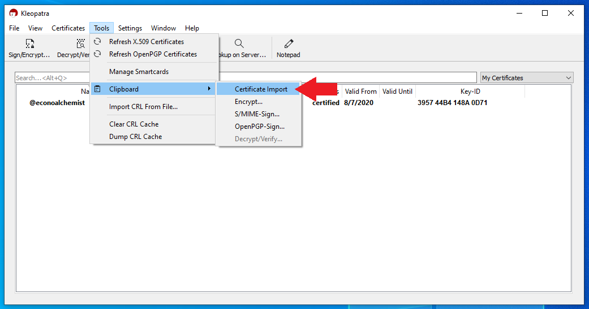

  
You can confirm that the finger print of the public key you just imported for Doc Hex matches the fingerprint of the Doc Hex account from KeyBase [here](https://keybase.io/dochex).

  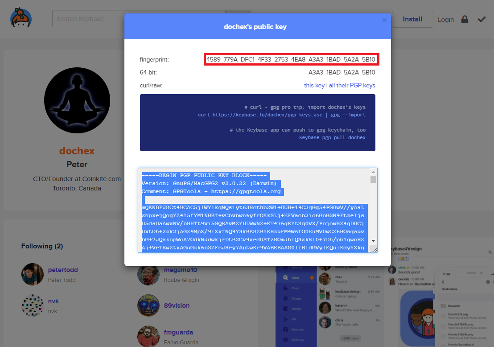

Now that you have Doc Hex's key imported and certified, you can verify that the signed message with the firmware hash values was actually signed by Doc Hex. Open the folder containing the signed message `.asc` file and right click on it, then select `More GpgEX options` then `Verify`.

  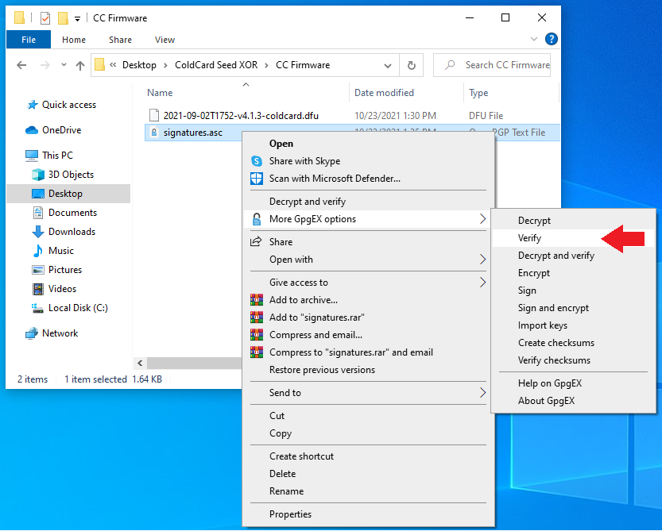

Kleopatra will start calculating the veracity of the signature and after a moment, you should receive a dialog box confirming that the signature matches the public key you certified. 

  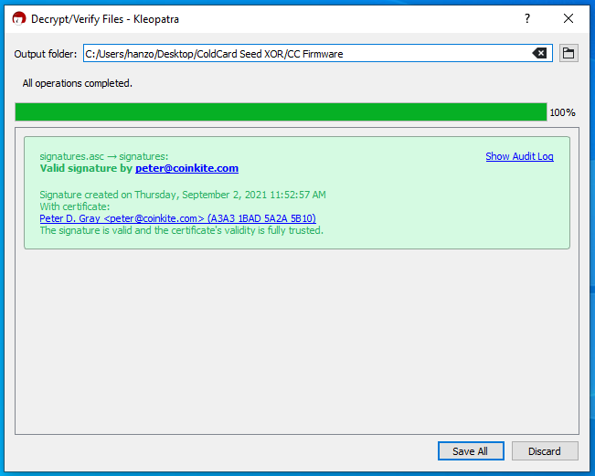

At this point, you have verified that the PGP signed message containing the hash values for the firmware files was in fact signed by Doc Hex. But you now need to verify that the `.dfu` firmware file does in fact return the same hash value as the one in the signed message. 

To do this, a freeware hex editing program called [HxD](https://mh-nexus.de/en/hxd/) is a user-friendly tool. Once the application is downloaded and launched, simply navigate to `File` then select `Open` and navigate to the file path where you have the firmware `.dfu` file is saved. Once opened, then navigate to `Analysis` then `Checksums` then scroll down to `SHA-256` and hit `OK`. Then the software will return the calculated Sha256 hash value on the firmware file you downloaded. Visually compare this returned hash value with the hash value that you can look at in the signed message by opening it with a text editor.

  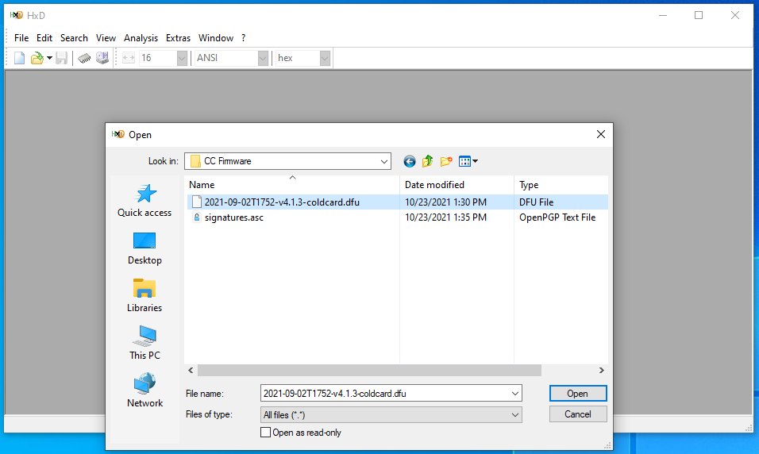
  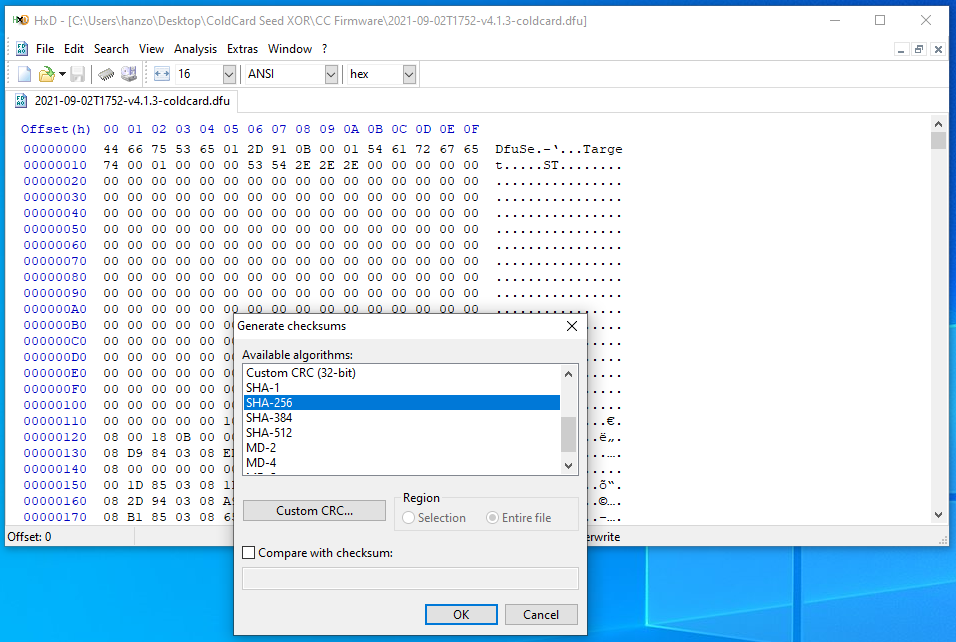
  

Now you know that the firmware file you downloaded is an exact match to the file that Coinkite intended you receive and that it is safe to install on your new COLDCARD. 

Using a microSD card (up to 32 GB capacity, FAT32 or FAT12 format) and a USB adaptor, insert them into your desktop. Once recognized, just drag and drop the firmware `.dfu` file onto the microSD card. Then safely eject the microSD card.

  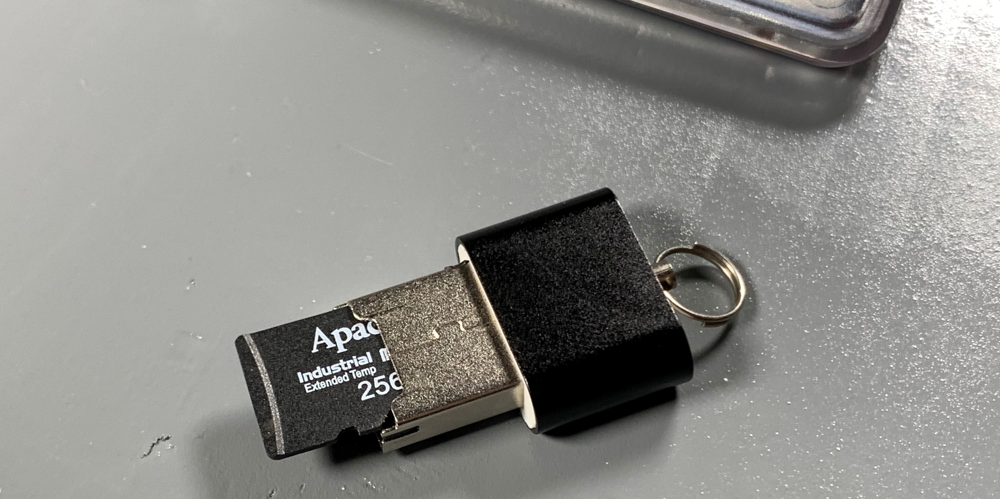
  

Turn the COLDCARD over and insert the microSD card into the slot until it clicks in place. 

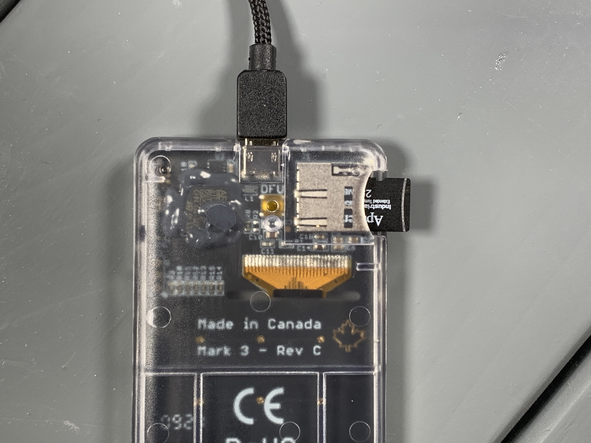

You should still be in the `Advanced` menu, then scroll down to `Upgrade Firmware` > `From MicroSD` then select the firmware file. This will take a moment to automatically load, verify and upgrade. 

  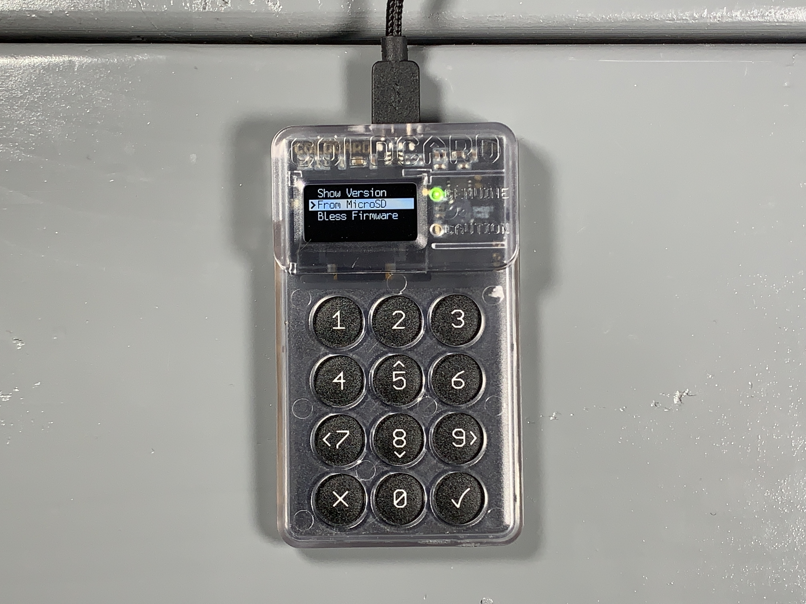
  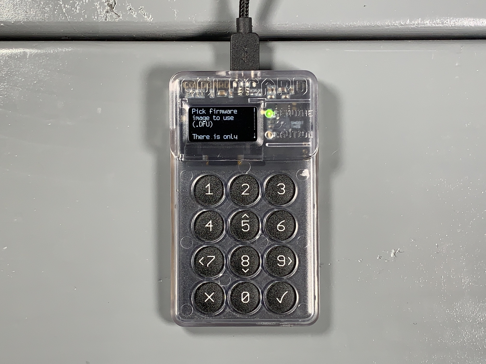

  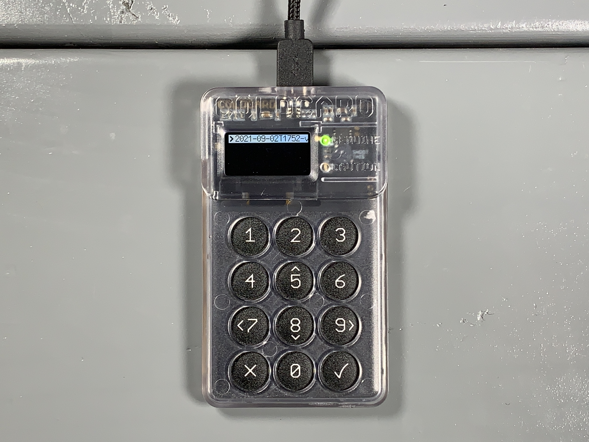
  

With the firmware now upgraded, you're ready to move on and set your PIN number. 

