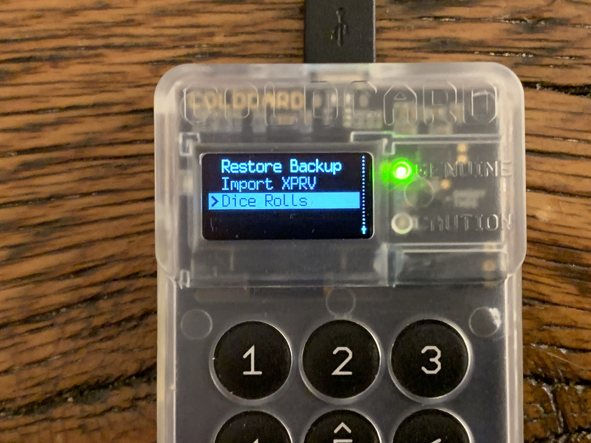
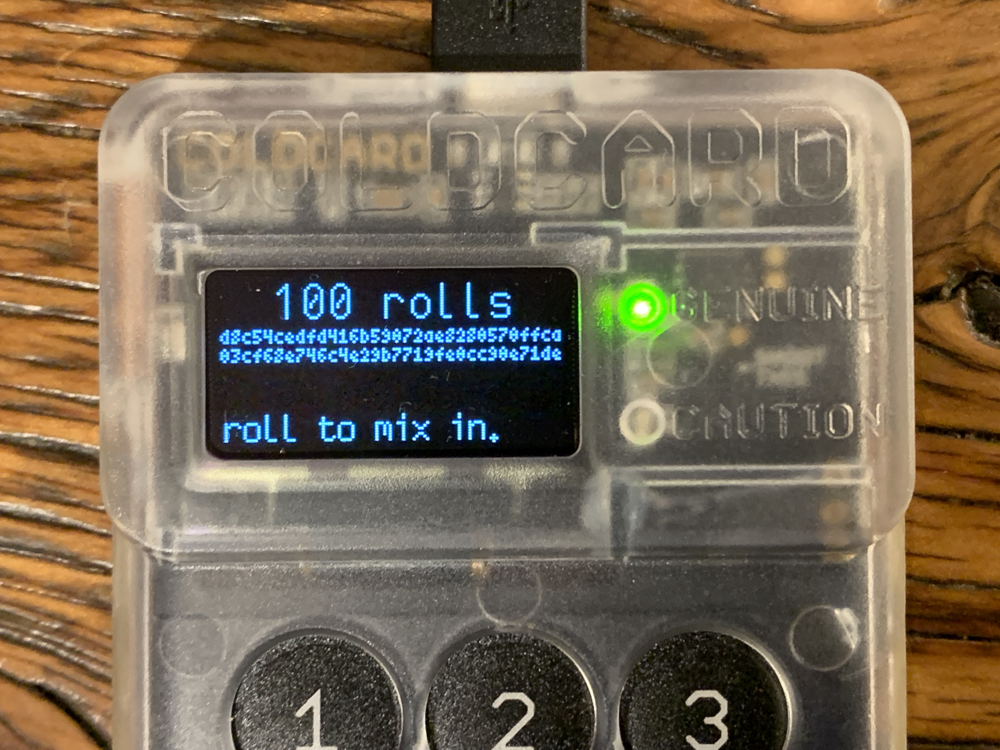
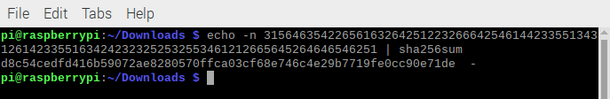

## Verifying the dice roll math
In this section you will see how to verify that the COLDCARD dice roll math is doing what it purports to be doing. Understanding that it is not advisable to use your actual dice rolls to validate the dice-roll math is important. Meaning that a user only should enter a few dice rolls, write them down, and generate the list of 24-words and then verify that information. This is only to satisfy one's curiosity that the COLDCARD is producing a list of seed words that accurately represent the random dice rolls that the user entered. Once that curiosity has been satisfied, then the process should be repeated without typing the dice rolls into a computer. By typing into a computer the actual entropy used in calculating a seed phrase that will be funded, the user risks potential loss of funds if the computer has been compromised. Additionally, this would diminish the benefits of having an air-gapped cold storage wallet since the computer is a network connected device. Typing seed words or dice rolls for an actual wallet that the user plans to fund is a bad idea. Simply use this information as a guide to understand that the COLDCARD is doing what it purports to be doing and then do the actual wallet creation with information that is never typed into the computer. Another resource for the dice roll math verification can be found [here](https://coldcardwallet.com/docs/verifying-dice-roll-math).

First, navigate to `Import Existing` then `Dice Rolls`.

  
  

Once there, the "0 rolls" screen will always be displayed with the hash value, `e3b0c... 27ae4... b855` since that is sha256 over an empty string. The keys 1-6 on the COLDCARD can be used to enter the values that correspond to the results of each dice roll.

  

Write down each dice roll as it is entered into the COLDCARD. Do as many rolls as it takes to satisfy your curiosity. In this example, 100 dice rolls. 

  

With a pen & notepad, start rolling the dice, writing down the number 1-6, and entering the number on the COLDCARD as you go along.

Now that the dice rolls have been copied to the notebook and entered into the COLDCARD, see what 24-word seed phrase the COLDCARD comes up with by selecting <kbd>OK</kbd> on the COLDCARD, the list of 24-words should then be presented. Also write these down in order along with the dice rolls.

  

I did the following on a RaspberryPi in the CLI shell. The idea with the following command is to verify the sha256 has value of the entered dice roll. In my example, my dice roll was 100 numbers in length and the resulting hash value was a match compared to the one displayed on the COLDCARD when I reached 100 rolls. So enter the following command in your terminal replacing `123456` with the dice rolls your wrote down. 

`$ echo -n 123456 | sha256sum`

  
  

Now it has been verified that the resulting hash value displayed on the COLDCARD does indeed represent the numbers from the entered dice rolls. But how do we know the hash value really generates the same 24 words?

The ideal environment to perform this verification is a computer running Tails - [The Amnesic Incognito Live System](https://tails.boum.org/), preferable without any network connection and no hard drives. Do not use your actual dice rolls on a normal desktop system as that will completely comprise the security of your COLDCARD!

Simply navigate to: https://coldcardwallet.com/docs/rolls.py and save the script. From the command line terminal, change directories to where you saved it. Once there, run the following command with the same dice rolls used on the first command, again replacing '123456' with the dice rolls you wrote down.

`$ echo 123456 | python3 rolls.py`

The returned data will be a list of 24 words that should match the ones written in the notebook.

  

Now the 24-word seed phrase has been independently verified and the COLDCARD can be trusted to be doing what it purports to be doing. Once your curiosity has been satisfied that everything is working as expected and advertised, now repeat the process with you actual dice rolls on the COLDCARD and do not enter them into the computer when you're done.

