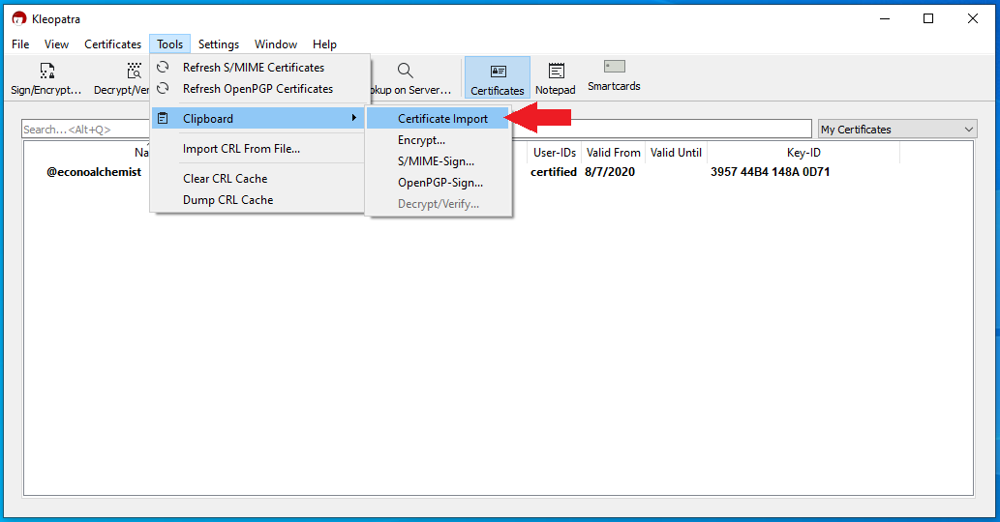
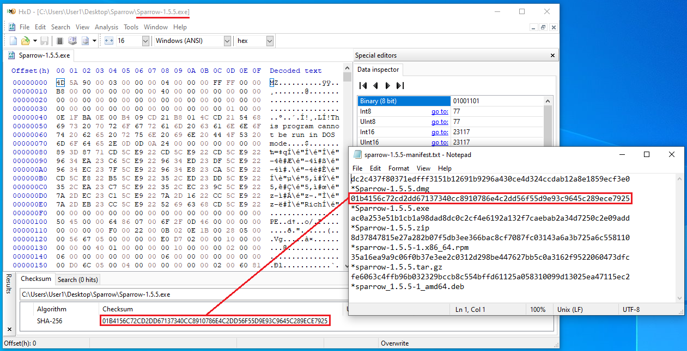

## Creating a passphrase
A passphrase can be thought of as a "25th word" that only you know. The passphrase can be anything you want it to be and is not restricted to the [BIP39 word list](https://github.com/bitcoin/bips/blob/master/bip-0039/english.txt) like the other 24-words. Passphrases can include upper case letters, lower case letters, numbers, or any ASCII characters. Passphrases on a COLDCARD can be up to 100-characters in length. By adding a passphrase to your 24-word seed phrase, you ensure that two pieces of information are required to gain access to your bitcoin. Which is why I recommend using high-entropy passphrases, because if someone gains access to your 24-word seed phrase then the only thing protecting your bitcoin is the strength of your passphrase. These two pieces of information can be stored in separate geographic locations and stamped into metal for added security and safeguard against environmental hazards. Using multiple passphrases on the same 24-word seed phrase can open up some interesting duress possibilities where the user can keep a small amount of honeypot funds while still protecting the majority stash. 

Important to note is that any passphrase entered will generate a fully functional and valid wallet, whether this wallet contains the keys to your bitcoin depends on your ability to enter the exact same passphrase again. Ensure that you write down your passphrase correctly. There is absolutely no way for the COLDCARD to know what your passphrase is. There is no way to recover a lost or forgotten passphrase. 

When you add a passphrase to a 24-word seed phrase, the new wallet will have its own fingerprint. This fingerprint can be used to verify that you have entered your passphrase correctly. You can start to see how this adds some complexity to securing your bitcoin. Keep this in mind and what your threat model is. Ask yourself how you will secure your recovery information, and how your loved ones would recover your bitcoin if you were gone.

From the main menu, select `Passphrase`, then you will see a short explanation that warns you about how passphrases are not recoverable so if you lose your passphrase then you will lose access to your funds. It also warns you that any passphrase you enter will generate a completely separate wallet. After reading through the warning select <kbd>OK</kbd> to continue, then select `Edit Phrase` and you have a few options of passphrases you can enter: 

* Choose any assortment of characters, for example: &BBq*$@R^!%nu6Y5
* Choose from lowercase words, for example: alarm wool culture nothing exercise
* Choose from uppercase words, for example: NOVEL RITUAL BOOK INDICATE VOLCANO
* Choose any assortment of numbers, for example: 582328549321278677354
* Choose any combination of any of the above, for example: &BBqNOVELalarmRITUALwool5823

You can make your passphrase whatever you want. Just keep in mind that if you lose it, you lose your bitcoin. Keep in mind too that it may not be you recovering your funds, it might be your spouse or child or someone else, so think about how complex your security model is and if they will be able to use it if you were gone.

Once you have entered the passphrase you want, select `APPLY` then you will be presented with the new wallet fingerprint. It is important to write this fingerprint down so that you can always verify that your passphrase was entered correctly. Then hit <kbd>OK</kbd> to enter this new wallet.

  
  

  
  

At this point, it is best practice to double check your work by trying to regenerate this fingerprint. If you have properly documented everything, then you should be able to log out of the COLDCARD, power it down, power it back on, log in again, re-apply the passphrase and get the same fingerprint from the wallet. If everything checks out then make sure you secure your passphrase and your 24-word seed phrase in a way that satisfies your unique threat model. 

Next, you will see how to download and verify Sparrow Wallet. 

## Verifying the Sparrow Wallet Download
Sparrow Wallet is a Bitcoin wallet designed to be connected with your own node and ran from your desktop or laptop computer. This is a user-friendly wallet with an intuitive interface and many advanced features for a range of capabilities. To learn more about Sparrow Wallet and for installation instructions, visit the [Sparrow Wallet website](https://www.sparrowwallet.com/).

In this section you will see how to verify the integrity of the Sparrow Wallet download on a Windows desktop using Kleopatra OpenPGP from the [GPG4win](https://www.gpg4win.org/download.html) bundle. If you are using a Linux distribution, you will want to use [GnuPG](https://gnupg.org/download/index.html). Or if you are using a Mac, you will want to use [GPGtools](https://gpgtools.org/). The basic process here is to save the PGP signed hash values of the releases and verify them with [Craig Raw's](https://twitter.com/craigraw) PGP public key and then calculate your own hash value on the firmware file to confirm.

The first step is to add Craig's PGP public key to your keychain. You can download his public key from KeyBase [here](https://keybase.io/craigraw/). If you are using Kleopatra, you can just copy the PGP public key to your clipboard and then navigate to `Tools` > `Clipboard` > `Certificate Import`. Then you can certify the PGP public key. 

  
  

Once you have the certificate import complete, navigate to the [Sparrow Wallet download page](https://sparrowwallet.com/download/) where you will want to download the appropriate Sparrow Wallet file for your operating system as well as the `Manifest` & `Manifest Signature` files. 

  

  

With those files saved in the same file directory, right-click on the `Sparrow-x.x.x-Manifest.txt` file then `More GpgEX options` > `Verify`. 

  

 

Then Kleopatra will verify the signature of the `Manifest` file against the certified PGP public key you imported and produce a valid result. 

  

Now you know that the contents of the `Manifest.txt` file are valid and signed by Craig's PGP key. What you want to do at this point is verify that the Sparrow Wallet file you downloaded computes the same hash value as the one contained in the `Manifest.txt` file. To do this, a freeware hex editing program called [HxD](https://mh-nexus.de/en/hxd/) is a user-friendly tool. Once the application is downloaded and launched, simply navigate to `File` then select `Open` and navigate to the file path where you have the Sparrow Wallet file is saved. Once opened, then navigate to `Analysis` then `Checksums` then scroll down to `SHA-256` and hit `OK`. Then the software will return the calculated Sha256 hash value on the firmware file you downloaded. Visually compare this returned hash value with the hash value that you can look at in the signed message by opening it with a text editor. 

  

Now you can double-click on the Sparrow Wallet `.exe` file and launch the installation wizard that will guide you through installing Sparrow Wallet.  

Next we'll get the COLDCARD configured as a "watch-only" wallet in Sparrow Wallet and demonstrate how to transact in an air-gapped fashion. 

