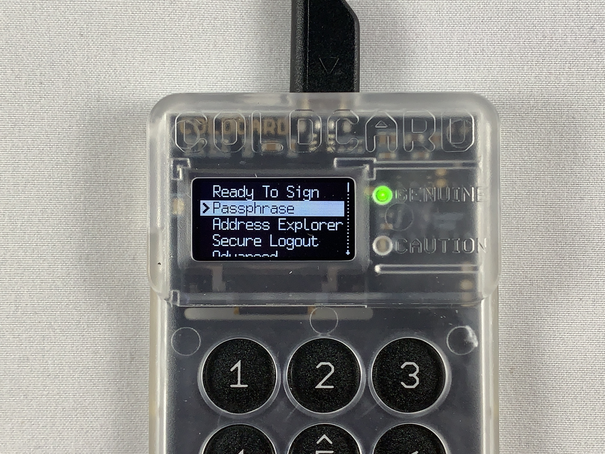

## Creating a passphrase
A passphrase can be thought of as a "25th word" that only you know. The passphrase can be anything you want it to be and is not restricted to the [BIP39 word list](https://github.com/bitcoin/bips/blob/master/bip-0039/english.txt) like the other 24-words. Passphrases can include upper case letters, lower case letters, numbers, or any ASCII characters. Passphrases on a COLDCARD can be up to 100-characters in length. By adding a passphrase to your 24-word seed phrase, you ensure that two pieces of information are required to gain access to your bitcoin. Which is why I recommend using high-entropy passphrases, because if someone gains access to your 24-word seed phrase then the only thing protecting your bitcoin is the strength of your passphrase. These two pieces of information can be stored in separate geographic locations and stamped into metal for added security and safeguard against environmental hazards. Using multiple passphrases on the same 24-word seed phrase can open up some interesting duress possibilities where the user can keep a small amount of honeypot funds while still protecting the majority stash. 

Important to note is that any passphrase entered will generate a fully functional and valid wallet, whether this wallet contains the keys to your bitcoin depends on your ability to enter the exact same passphrase again. Ensure that you write down your passphrase correctly. There is absolutely no way for the COLDCARD to know what your passphrase is. There is no way to recover a lost or forgotten passphrase. 

When you add a passphrase to a 24-word seed phrase, the new wallet will have its own fingerprint. This fingerprint can be used to verify that you have entered your passphrase correctly. You can start to see how this adds some complexity to securing your bitcoin. Keep this in mind and what your threat model is. Ask yourself how you will secure your recovery information, and how your loved ones would recover your bitcoin if you were gone.

From the main menu, select `Passphrase`, then you will see a short explanation that warns you about how passphrases are not recoverable so if you lose your passphrase then you will lose access to your funds. It also warns you that any passphrase you enter will generate a completely separate wallet. After reading through the warning select <kbd>OK</kbd> to continue, then select `Edit Phrase` and you have a few options of passphrases you can enter: 

* Choose any assortment of characters, for example: &BBq*$@R^!%nu6Y5
* Choose from lowercase words, for example: alarm wool culture nothing exercise
* Choose from uppercase words, for example: NOVEL RITUAL BOOK INDICATE VOLCANO
* Choose any assortment of numbers, for example: 582328549321278677354
* Choose any combination of any of the above, for example: &BBqNOVELalarmRITUALwool5823

You can make your passphrase whatever you want. Just keep in mind that if you lose it, you lose your bitcoin. Keep in mind too that it may not be you recovering your funds, it might be your spouse or child or someone else, so think about how complex your security model is and if they will be able to use it if you were gone.

Once you have entered the passphrase you want, select `APPLY` then you will be presented with the new wallet fingerprint. It is important to write this fingerprint down so that you can always verify that your passphrase was entered correctly. Then hit <kbd>OK</kbd> to enter this new wallet.

  
  

  
  

At this point, it is best practice to double check your work by trying to regenerate this fingerprint. If you have properly documented everything, then you should be able to log out of the COLDCARD, power it down, power it back on, log in again, re-apply the passphrase and get the same fingerprint from the wallet. If everything checks out then make sure you secure your passphrase and your 24-word seed phrase in a way that satisfies your unique threat model. 

Next, you will see how to download and verify Sparrow Wallet. 
