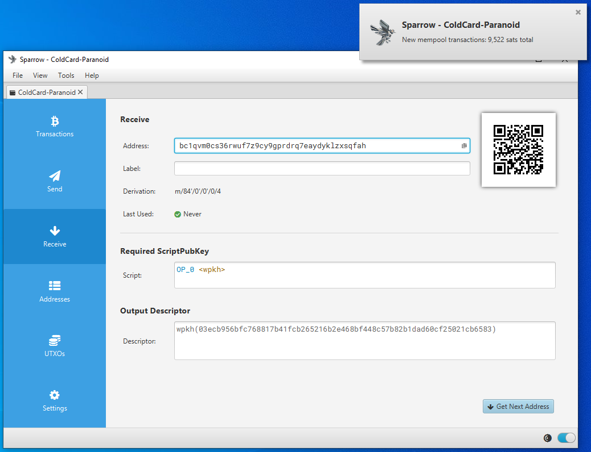

## Connecting COLDCARD to Sparrow Wallet
In this section you will see how to connect your COLDCARD to Sparrow Wallet using a your own Electrum Rust Server connected over Tor. If you don't have your own Electrum Rust Server, you can use BitcoinCore as a backend as demonstrated in the [MiddleGround guide](https://github.com/econoalchemist/ColdCard-MiddleGround). However, BitcoinCore stores your wallet balances and xpub unencrypted on your desktop. Or if you don't have your own Bitcoin node, you can use reputable public Electrum servers as demonstrated in the [UltraQuick guide](https://github.com/econoalchemist/ColdCard-UltraQuick). However, there are privacy tradeoffs that come with using the convenience of a public Electrum server. Luckily there are a number of resources available to help you spin up your own Bitcoin node, to learn more check out:

- [RaspiBlitz](https://github.com/rootzoll/raspiblitz)
- [Bitcoin.org](https://bitcoin.org/en/bitcoin-core/)
- [Ministry of Nodes](https://www.ministryofnodes.com.au/) 
- [Sparrow Wallet Documentation](https://www.sparrowwallet.com/docs/connect-node.html)

In this guide, RaspiBlitz will be demonstrated as the provider of the Electrum Rust server. Not because this has anything to do with Lightning, only because RaspiBlitz is an easy to install and stable Bitcoin node that features Electrum Rust server capabilities that are really easy to configure with Sparrow Wallet. Unlike BitcoinCore though, RaspiBlitz is designed to be run on the ARM64 architecture as you would find in single-board computers such as a RaspberryPi. [Here](https://www.econoalchemist.com/post/build-a-self-custodial-lightning-node-with-raspiblitz) is a guide on building a RaspiBlitz if you need it. Once you have your Bitcoin node ready, there are a couple steps needed to configure it to work with Sparrow Wallet. 

Since RaspiBlitz is running on a remote computer, you need to SSH into the RaspberryPi and gather some information. First, you need to initiate Electrum Rust Server which can take several hours as it indexes the entire blockchain. From your RaspiBlitz main menu, scroll down to and select `SERVICES`> `BTC Electrum Rust Server`. Then follow the prompts to initiate the indexing and give the operation plenty of time to run.   

  
  

After Electrum Rust Server is initialized and indexed, you will notice that there is a new `ELECTRS` option on your RaspiBlitz main menu. Select that menu option.  

  

Next you will see the option to `CONNECT`, select that option and you will be presented with the necessary information that is needed to enter into the Sparrow Wallet server configuration. You want to copy the entire `.onion` URL and observe the port number, typically `50002`. This is the information you will put in the Sparrow Wallet server configuration. The `.onion` URL has been censored for privacy reasons in the photos below, this is information you want to keep private.

  
  

Ensure that you have your Tor browser open and connected. Also launch Sparrow Wallet and then navigate to `File` > `Preferences` then click on the <kbd>Server</kbd> tab on the left-hand side. Click on the <kbd>Private Electrum</kbd> tab for the `Server Type` then paste the `.onion` URL and enter the port number. Test the network connection from Sparrow Wallet. If it’s good, you should see the green check mark next to <kbd>Test Connection</kbd> and some information populated in the dialog box below that. Then you can close that window.

  
  

Sparrow Wallet is now configured to use your private Electrum Rust Server as a backend over Tor. To learn more about Sparrow Wallet best practices, check out [this Sparrow Wallet resource](https://www.sparrowwallet.com/docs/best-practices.html) guide. 

Now that Sparrow Wallet is connected with Electrum Rust Sever, this is a good time to get the watch-only wallet file exported from the COLDCARD. Then it can be imported to Sparrow Wallet. So connect your COLDCARD to the COLDPOWER adaptor and log into the COLDCARD. 

In order to keep your COLDCARD air-gapped, the Partially Signed Bitcoin Transaction (PSBT) can be utilized to spend bitcoin from the COLDCARD without ever connecting it to the internet. Basically, the public information from the COLDCARD called an XPUB will be used to import the necessary information into Sparrow Wallet on our desktop. By doing this, Sparrow Wallet will be able to generate receive addresses and QR codes, monitor the COLDCARD's balance, and initiate PSBT's. All without exposing any of the private information from the ColdCard, like the signing key. 

You will use the microSD card to transfer information between the desktop and the COLDCARD. Ensure the microSD card is inserted to the COLDCARD. 

First, the `.json` file needs to be exported from the COLDCARD, which will contain all the public information necessary so that Sparrow Wallet can import this watch-only wallet. From the COLDCARD main menu select `Advanced` > `MicroSD Card` > `Export Wallet` > `Generic JSON`. You can leave the account number blank.  

  
  

  
  

This is going to write the file to the microSD card, then you can connect that microSD card to your desktop computer with your USB adaptor. Copy/paste the exported `.json` file to your desktop from the microSD card. Notate the file location and now you will switch back to Sparrow Wallet to get it ready to import the `.json` file. 

In Sparrow Wallet, create a new wallet by selecting `File` > `New Wallet`, then you will be asked to name this wallet. Name the wallet whatever you want then click on <kbd>Create Wallet</kbd>. You will notice in the Sparrow Wallet interface lower right-hand corner that the color has changed to blue on the toggle switch. This indicates that your wallet is using your instance of Electrum Rust Server as the back end.

  

You will see the following screen, you can leave all the settings on the defaults. Then select <kbd>Airgapped Hardware Wallet</kbd>. 

  

A screen will pop up and you can click on the <kbd>Import File...</kbd> button next to the COLDCARD icon. This will open your file explorer where you can point Sparrow Wallet to the file location containing the exported COLDCARD `.json` file. Select that file and click on <kbd>open</kbd>. 

  

After a moment, you will see a summary of the wallet you are about to apply. You will notice a "Master fingerprint" dialog box with 8-characters in it. You can use this unique identifier to confirm that you are importing the correct wallet from your COLDCARD. 

On your COLDCARD, from the main menu, navigate down to `Advanced` > `View Identity` and you can compare the displayed fingerprint to the one displayed in Sparrow Wallet. This is especially important to confirm if you have added a passphrase which will be covered in the [Paranoid guide](https://github.com/econoalchemist/ColdCard-Paranoid).

If everything looks good, then click on <kbd>Apply</kbd> in Sparrow Wallet. 

  
  

After clicking on <kbd>Apply</kbd>, you will have the opportunity to add a password to your wallet. This is a password which will encrypt the Sparrow Wallet data file that is saved on your computer. This password can protect your wallet if someone else gains access to your desktop and Sparrow Wallet file. If you forget your password, you will need to create a new wallet file by repeating this whole process. 

  

You can also save a list of deposit addresses from your COLDCARD and compare this saved list to Sparrow Wallet to ensure the correct wallet is loaded without having to retrieve your COLDCARD, login to it, and compare the deposit addresses there. To do this, select the `Receive` tab in Sparrow Wallet then you can view the first receiving address from your COLDCARD and its QR code. On your COLDCARD, make sure you insert the microSD card and enter your passphrase if applicable. Then from the main menu, select `Address Explorer`. This will bring up a few address types that you can choose to view. Your COLDCARD can use legacy P2PKH Bitcoin addresses that start with "1", or nested SegWit P2SH Bitcoin addresses that start with "3", or Native SegWit Bech32 Bitcoin addresses that start with "bc1". Then you want to press <kbd>1</kbd> and this will save the first 250 addresses to a `.csv` file on your microSD card. You can also open the `addresses.csv` file with a text editor on your desktop to view the 250 addresses you exported from your COLDCARD and compare them to your Sparrow Wallet just for the added assurance. 

  

After applying the changes, you can now navigate through your watch-only wallet in Sparrow Wallet. On the left-hand side of the Sparrow Wallet interface there are six tabs. The <kbd>Transactions</kbd> tab is where you can see information related to the transactions in this watch-only wallet. The <kbd>Send</kbd> tab is where you can create the PSBTs to then export for signing by the COLDCARD. The <kbd>Receive</kbd> tab is where you can generate receive address for your COLDCARD without having to plug in your COLDCARD and log into it. The <kbd>Addresses</kbd> tab shows several deposit and change addresses as well as any balances. The <kbd>UTXOs</kbd> tab shows any unspent transaction outputs and a small graph charting the history. Finally, the <kbd>Settings</kbd> tab is where you can see detailed information about the watch-only wallet such as the master fingerprint, derivation path, & xpub.   

Now you can click on the <kbd>Receive</kbd> tab on the left-hand side of the Sparrow Wallet interface. Then you will be presented with a bitcoin receiving address, a QR code, and some additional details. You can scan this QR code with your mobile Bitcoin wallet, for example, and deposit some bitcoin to your COLDCARD. You should see the transaction show up in Sparrow Wallet after a moment along with a pop-up notification. Also, in BitcoinCore, the transactions should show up there as well. The transaction will remain in a pending status until it receives some blockchain confirmations. In the mean-time, you can click on the <kbd>Transactions</kbd> tab and review further details about your transaction. You can also copy/paste your transaction ID in [mempool.space](https://mempool.space/) to watch for your first confirmation, or use whatever your preferred block explorer is. [Tor Browser](https://www.torproject.org/download/) is a privacy-focused browser.  

  
  
  
  

Now you can power off and secure your COLDCARD in a safe place until you want to sign a transaction and spend from it, several addresses will be cataloged in Sparrow Wallet so you can continue depositing to your COLDCARD via Sparrow Wallet without having to reconnect it every time. It is best practice to confirm each receiving address on the COLDCARD itself and or your saved `.csv` file and additionally to only use each address once. 

When you are ready to sign a transaction to spend bitcoin, it is necessary to create a PSBT in order to maintain the air-gapped benefit. You can deposit bitcoin with your COLDCARD disconnected but to spend bitcoin, the COLDCARD needs to sign the transaction. Sparrow Wallet is used to build the transaction based on your available Unspent Transaction Outputs (UTXOs) and the information you enter when constructing the transaction. The PSBT details are passed between Sparrow Wallet and the COLDCARD using the microSD card. 

To create a PSBT, navigate to the <kbd>Send</kbd> tab on the left-hand side in Sparrow Wallet. There, you can paste the address you are sending to, add a label, enter an amount to send, and choose a miners fee rate, etc. Once you have everything set, click on <kbd>Create Transaction</kbd>. On the next screen, double check the details then click on <kbd>Finalize Transaction for signing</kbd>. Then you will be asked what you want to do with the finalized PSBT. In this case, click on <kbd>Save Transaction</kbd> and Sparrow Wallet will launch the file explorer. Navigate to the microSD card and save the PSBT there. Then safely eject the microSD card.  

  
  
  
  

  
Insert the microSD card into the COLDCARD. If necessary, power on your COLDCARD using the COLDPOWER 9v battery adaptor or USB adaptor. Then enter your COLDCARD PIN prefix, verify your anti-phishing words, and enter the PIN suffix. Enter and apply your passphrase, double check the fingerprint, then from the main menu choose `Ready to Sign`. Then the details of the PSBT will be displayed and you can confirm that the address and the amount and the miners fee are correct.    

  
  

  
Then hit <kbd>OK</kbd> to sign. Once the file is signed it will be saved as a new file to the microSD card appended with `-signed.psbt`. You can then eject the microSD card and securely log out of your Cold Card and power it down. 
 

  

Eject the microSD card from the COLDCARD, insert to the USB adaptor, insert the adaptor into the desktop computer. Ensure Sparrow Wallet is open. Then from the file explorer, simply double-click on the signed PSBT file and it should open automatically in Sparrow Wallet. Alternatively, from Sparrow Wallet navigate to `File` > `Open Transaction` then choose `File` from the menu of options and navigate to the file location of the signed PSBT. Either way, then click on the <kbd>Broadcast Transaction</kbd> button to send the signed transaction to the Bitcoin Network. 

  
  

                                                          
At the time of broadcast you should see the transaction notification in Sparrow Wallet. Again, you can copy the transaction ID and paste in your preferred block explorer to watch for confirmations.
                                                          

  
  

The main point here is that your COLDCARD is the required signing device while your Sparrow Wallet is your interface, transaction builder, & broadcaster. In this configuration, Sparrow Wallet can do many things like catalog addresses and build transactions but without the signature from your COLDCARD, Sparrow Wallet cannot authorize spending of any of your bitcoin. 

Not only is your bitcoin secured by your air-gapped COLDCARD, but the interface you use to interact with it is backed by your own private Electrum Rust Server over Tor. Another recent capability implemented in Sparrow Wallet is Whirlpool CoinJoins. You can configure Sparrow Wallet to deposit your CoinJoined outputs directly to your COLDCARD. This topic goes beyond the scope of this guide but keep in mind that there are a range of features and capabilities for both COLDCARD and Sparrow wallet that are not covered here. To learn more about an advanced feature in COLDCARD called Seed XOR, check out [this](https://www.econoalchemist.com/post/coldcard-seed-xor) guide. Also, to learn more about Sparrow Wallet & Whirlpool, check out [this](https://www.sparrowwallet.com/docs/mixing-whirlpool.html) guide.

## Steel plate backup demonstration
Careful considerations should be made in regards to how the wallet backup information will be stored. The information required for a proper backup varies depending on how the wallet was setup. These requirements may be only 24-words for a simple wallet or the requirements can include 24-words, a passphrase, master fingerprint, derivation path, and more. There are several options when it comes to picking a storage medium, each has its own set of tradeoffs. Writing the 24-words on paper is a good start and helps mitigate the risks associated with having a digital copy of the backup information. With the backup information written down on paper, an adversary would need physical access to the paper in order to retrieve the information. Where as a photo, text file, or other digital medium can be copied and replicated and shared quickly or accessed remotely. 

The trade off with paper backups is that they do not withstand fire or flooding very well. This is where steel backups come into play. Robust backups made from stainless steel can withstand fire temperatures beyond the range of a typical house fire, up to 1,500°C. Also stainless steel backups can withstand being submerged in water for extended periods of time. There is a wide range of steel backups available. Coinkite offers the [SEEDPLATE](http://bitcoinseedbackup.com/) which gives users a robust backup option that is resistant to fire and flooding as well as easy to conceal.   

  
  

These stainless steel plates are etched with a grid on both sides. The grid contains the alphabet along the Y-axis and 48-columns along the X-axis. The 48-columns are split into 12 groups of 4-columns. Each of the 12-groups has enough room for 4-letters. Only the first 4-letters of each BIP39 seed word is required in order to restore the wallet as no two words on the BIP39 word list share the same sequence of the first 4-letters. 

Use a marker to indicate the first 4-letters of the first 12-words on one side of the plate and then flip the plate over and repeat the process for the 13th through 24th words. If you make a mistake you can clean the marker off with acetone/nail polish remover and remark the letter. 

  
  
  

  
 
Double check your work then use a spring-loaded punch to stamp the plate on each mark.
  
  
  
  

Now you have a robust stainless steel backup that can withstand fire and flood. This backup plate is easy to conceal measuring in at 127mm X 76mm x 1.5mm so that it can be hidden in a variety of places and environments. 

