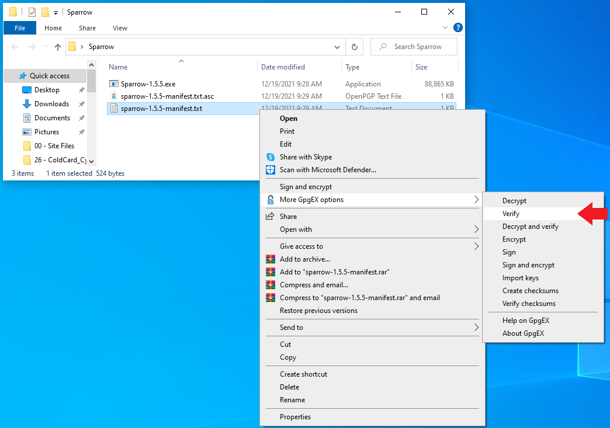
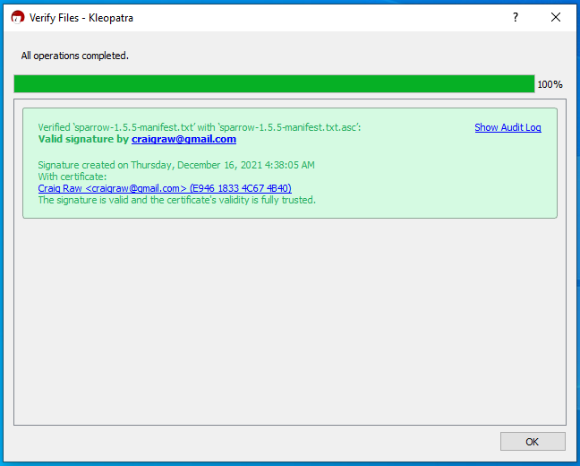

## Verifying the Sparrow Wallet Download
Sparrow Wallet is a Bitcoin wallet designed to be connected with your own node and ran from your desktop or laptop computer. This is a user-friendly wallet with an intuitive interface and many advanced features for a range of capabilities. To learn more about Sparrow Wallet and for installation instructions, visit the [Sparrow Wallet website](https://www.sparrowwallet.com/).

In this section you will see how to verify the integrity of the Sparrow Wallet download on a Windows desktop using Kleopatra OpenPGP from the [GPG4win](https://www.gpg4win.org/download.html) bundle. If you are using a Linux distribution, you will want to use [GnuPG](https://gnupg.org/download/index.html). Or if you are using a Mac, you will want to use [GPGtools](https://gpgtools.org/). The basic process here is to save the PGP signed hash values of the releases and verify them with [Craig Raw's](https://twitter.com/craigraw) PGP public key and then calculate your own hash value on the firmware file to confirm.

The first step is to add Craig's PGP public key to your keychain. You can download his public key from KeyBase [here](https://keybase.io/craigraw/). If you are using Kleopatra, you can just copy the PGP public key to your clipboard and then navigate to `Tools` > `Clipboard` > `Certificate Import`. Then you can certify the PGP public key. 

  
  

Once you have the certificate import complete, navigate to the [Sparrow Wallet download page](https://sparrowwallet.com/download/) where you will want to download the appropriate Sparrow Wallet file for your operating system as well as the `Manifest` & `Manifest Signature` files. 

  

  

With those files saved in the same file directory, right-click on the `Sparrow-x.x.x-Manifest.txt` file then `More GpgEX options` > `Verify`. 

  

 

Then Kleopatra will verify the signature of the `Manifest` file against the certified PGP public key you imported and produce a valid result. 

  

Now you know that the contents of the `Manifest.txt` file are valid and signed by Craig's PGP key. What you want to do at this point is verify that the Sparrow Wallet file you downloaded computes the same hash value as the one contained in the `Manifest.txt` file. To do this, a freeware hex editing program called [HxD](https://mh-nexus.de/en/hxd/) is a user-friendly tool. Once the application is downloaded and launched, simply navigate to `File` then select `Open` and navigate to the file path where you have the Sparrow Wallet file is saved. Once opened, then navigate to `Analysis` then `Checksums` then scroll down to `SHA-256` and hit `OK`. Then the software will return the calculated Sha256 hash value on the firmware file you downloaded. Visually compare this returned hash value with the hash value that you can look at in the signed message by opening it with a text editor. 

  

Now you can double-click on the Sparrow Wallet `.exe` file and launch the installation wizard that will guide you through installing Sparrow Wallet.  

Next we'll get the COLDCARD configured as a "watch-only" wallet in Sparrow Wallet and demonstrate how to transact in an air-gapped fashion. 

