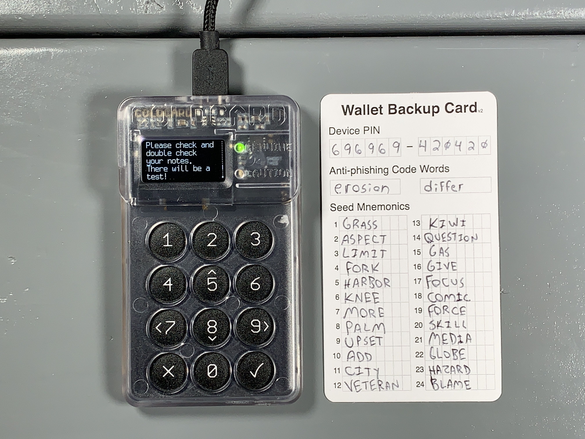

# ColdCard Paranoid Guide
A paranoid guide for advanced users to get from zero to self-custodied cold storage with a focus on security & verification. 

  

This guide covers:
- Checking the tamper-evident bag
- Verifying & updating firmware
- Setting up a PIN
- Generating a seed phrase with 256 bit of entropy by dice rolls
- Creating a passphrase
- Verifying the dice roll math
- Air-gapped communication between ColdCard and [Sparrow Wallet](https://www.sparrowwallet.com/)
- Steel plate backup demonstration

## Checking the tamper-evident bag:
Upon receiving your ColdCard, ensure that the tamper-evident bag has not been compromised. If anything seems amiss or if you have any problems contact [support@coinkite.com.](mailto:support@coinkite.com?subject=%5BContact%5D%20-%20) Visually inspect the surfaces and edges of the bag for indications of tampering, openings, or damage.

  
  

  
  

You will see the tamper-evident words "void" appear when the seal is opened. Inside you will find your new ColdCard, the Wallet Recovery Backup Card, sticker(s), and an additional copy of the bag number which should match the bag number printed on the outside of the bag. 

  
  

If everything looks good, then you are ready to power on your new ColdCard and get it setup. 

## Setting up a PIN
Here is a diagram you can reference to learn the ColdCard's navigation:

  

A great security feature of the ColdCard is that it can be used completely air-gapped. Meaning that you never have to connect it to a computer, although that option is there if you choose to use it. You can use a standard USB outlet transformer or even a 9v battery with the ColdPower adaptor, which CoinKite offers [here](https://store.coinkite.com/store/cldpwr). To power on the ColdCard simply connect a USB to micro-USB [cable](https://store.coinkite.com/store/category/accessories) to the port on top of the ColdCard and the other end to a USB port on your ColdPower adaptor & 9v battery.

  
  

Once powered on, first read and accept the terms of sale & use. Then you will be asked to confirm the bag number. If there are any discrepancies, contact [support@coinkite.com](mailto:support@coinkite.com?subject=%5BContact%5D%20-%20).

  

Make careful considerations with your PIN number. You don't want to use one that is easy to guess. Your PIN will have two parts, a prefix and suffix. The idea is that once you enter the prefix, you will be presented with two anti-phishing words. If the words are the same as the words that were originally presented to you at initial startup, then you know that your ColdCard has not been tampered with since the last time you accessed it. 

First, select "Choose PIN Code", then you will see a brief description of how the PIN code works. Each part of your PIN code can be between 2 and 6 digits. There is absolutely no way to access a forgotten or lost PIN. Also, if you enter a PIN incorrectly too many times, it will brick your ColdCard as a security feature.

  

After hitting "OK" you will get one more warning about the risk of losing or forgetting your PIN. After reading that, you can enter your PIN prefix. Use the included notecard to write down your PIN prefix then hit "OK". 

  
  

Next you will be presented with your two anti-phishing words. Write these down on your notecard.

  

Next, enter your PIN suffix, then write it down on the notecard and hit "OK".

  
  

Then you will be asked to re-enter your PIN prefix, confirm the two anti-phishing words, and enter your PIN suffix. The ColdCard will save that information and then open up the wallet where you can generate your seed phrase.

## Generating a seed phrase
There are a couple considerations you may want to make when creating a seed phrase. For example, ColdCard will generate a seed phrase for you by default, as shown in the [Ultra Quick guide](https://github.com/econoalchemist/ColdCard-UltraQuick). However, maybe you don't trust the True Random Number Generator (TRNG) in your ColdCard, you can introduce some of your own randomness using a six sided dice and combine that with the ColdCard's TRNG entropy. If you still don't trust the ColdCard is doing what it purports to be doing then you can generate a full 128 or 256 bits of entropy with dice rolls and even verify the dice roll math as shown in the [Paranoid guide](https://github.com/econoalchemist/ColdCard-Paranoid).

In the steps below you will see how to add some of your own entropy using a six sided dice combined with the TRNG entropy from the ColdCard to generate your seed phrase. After setting up the PIN, you should be at the ColdCard main menu. Select "New Wallet" and after a moment you will be presented with 24 words. However, to add some of your own dice roll randomness, scroll down to the bottom of the word list and select "4" to add some dice rolls.

  
  

Entropy is calculated by using: log2(6) = 2.58. Where the 6 is the number of sides on the dice. For reference, it would take the world's most powerful super computer trillions of years to brute force a 256 bit key. So roll the dice and enter the corresponding number for each roll. Repeat this process as much as you want. If you roll less than 50 times then the ColdCard will add the remaining necessary entropy with the TRNG. Then hit "OK".

  

  

Now you will be presented with a new list of 24 words. Write these words down on your notecard. Then double check your work. 

  
  

Next, you will be asked to take a test to prove you wrote the words down correctly. 

  

  

After passing the test, you will be at the ColdCard's main menu. Your ColdCard is ready to start receiving deposits, next we'll set it up as a "watch-only" wallet in Sparrow Wallet and demonstrate how to transact in an air-gapped fashion. If you are interested in adding the additional security of a passphrase to your ColdCard wallet, then check out the [Paranoid guide](https://github.com/econoalchemist/ColdCard-Paranoid).

## Connecting ColdCard to Sparrow Wallet
Sparrow Wallet is a Bitcoin wallet designed to be connected with your own node and ran from your desktop or laptop computer. This is a user-friendly wallet with an intuitive interface and many advanced features for a range of capabilities. To learn more about Sparrow Wallet and for installation instructions, visit the [Sparrow Wallet website](https://www.sparrowwallet.com/).

In this guide you will see how to connect your ColdCard to Sparrow Wallet using a your own BitcoinCore node. If you don't have your own Bitcoin node, you can use reputable public Electrum servers as demonstrated in the [UltraQuick guide](https://github.com/econoalchemist/ColdCard-UltraQuick). However, there are privacy tradeoffs that come with using the convenience of a public Electrum server. Luckily there are a number of resources avilable to help you spin up your own Bitcoin node, to learn more check out:

- [Bitcoin.org](https://bitcoin.org/en/bitcoin-core/)
- [Ministry of Nodes](https://www.ministryofnodes.com.au/) 
- [Soarrow Wallet Documentation](https://www.sparrowwallet.com/docs/connect-node.html)  
